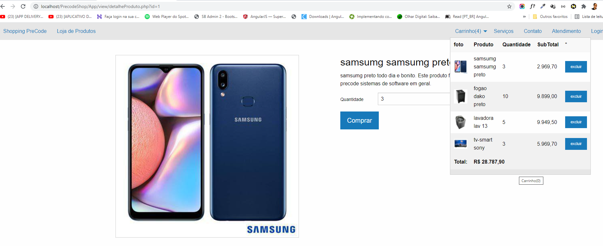
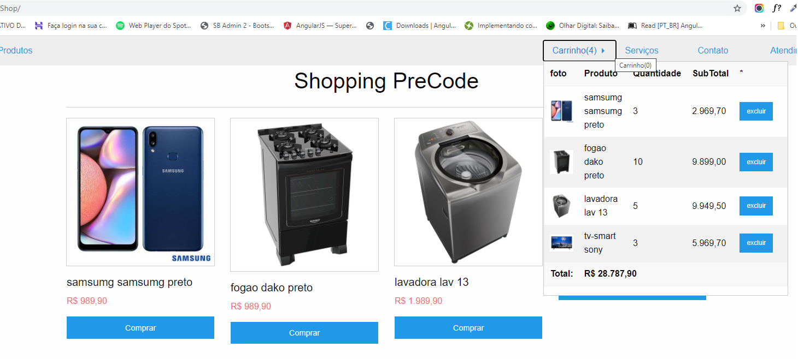

# ShoppingCart Precode 
Projeto Carrinho de compras Teste Precode desenvolvido em PHP 7

**Tecnologias usadas**
- PHP 7
- Composer
- PSR-4 (autoload class)
- PDO
- MVC
- DAO
- Mysql
- Xamp
- Jquery
- JavaScript
- Framework css foundation 
- Html5

- Obs: Toda manipulação dos itens no carrinho foi feita com $_SESSION e ajax + Jquery

**FOLDER NAME IN HTDOCS OU WWW**
Trocar nome da pasta em config.php, em  'PrecodeShop/');

**CONEXAO DATABASE**
Arquivo de conexão com banco de dados App/model/Connection.php

**HOME PAGINA DE COMPRAS**

**SINGLE PAGE DO PRODUTO**
